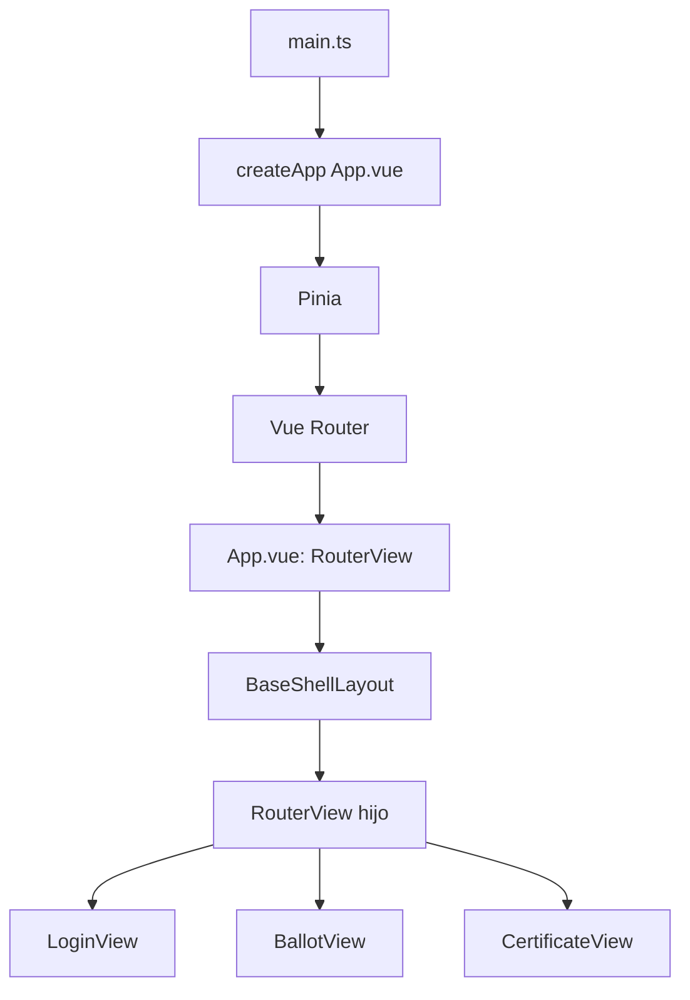
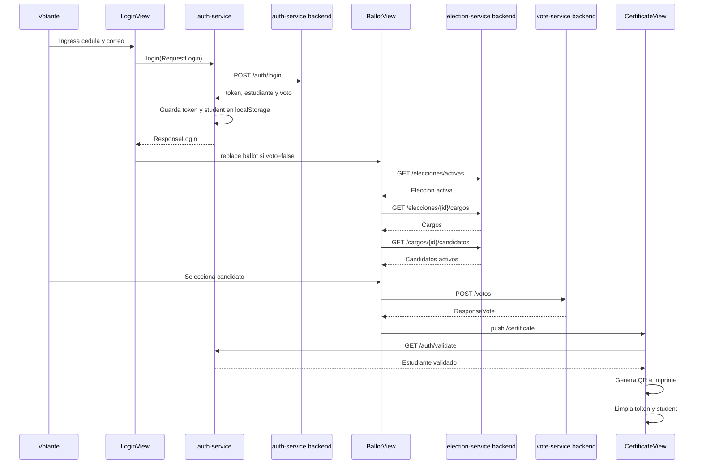

# Arquitectura y flujo del frontend Votante

Este documento describe el comportamiento que actualmente esta implementado en el frontend. La referencia principal es el codigo de `src/`; cuando una seccion menciona una mejora pendiente, se indica expresamente.

## 1. Resumen tecnico

- **Framework:** Vue 3 con Composition API y componentes `.vue`.
- **Build y desarrollo:** Vite.
- **Lenguaje:** TypeScript.
- **Navegacion:** Vue Router con `createWebHistory()`.
- **Estado global:** Pinia, usado actualmente para notificaciones.
- **HTTP:** Axios, con un cliente separado por microservicio.
- **Estilos:** Tailwind CSS y hojas globales en `src/assets/styles/`.
- **Datos locales:** `localStorage` para `token` y `student`.
- **Generacion de certificado:** paquete `qrcode` y dialogo de impresion del navegador.

## 2. Arranque de la aplicacion



1. `src/main.ts` importa estilos, crea Pinia y registra el router.
2. `src/App.vue` solo expone un `RouterView`.
3. El router carga `BaseShellLayout.vue` como contenedor padre.
4. `BaseShellLayout.vue` dibuja el fondo, muestra notificaciones y contiene el `RouterView` de la vista activa.
5. La ruta raiz redirige a `login`.

## 3. Rutas implementadas

| Ruta | Nombre | Vista | Proteccion actual |
|---|---|---|---|
| `/` | - | redireccion a `/login` | ninguna |
| `/login` | `login` | `src/views/login/LoginView.vue` | ninguna |
| `/ballot` | `ballot` | `src/views/dashboard/BallotView.vue` | ninguna |
| `/certificate` | `certificate` | `src/views/certificate/CertificateView.vue` | ninguna |

Todas las rutas estan dentro de `BaseShellLayout`. No hay `beforeEach`, guardias de autenticacion, ruta 404 ni control de acceso por estado de votacion.

## 4. Flujo funcional completo



### 4.1 Inicio de sesion

Archivo responsable: `src/views/login/LoginView.vue`.

1. El formulario exige que `cedula` y `correoInstitucional` no esten vacios.
2. `login()` de `src/services/auth-service.ts` envia ambos valores a `POST /auth/login`.
3. Si la respuesta es correcta, se guarda:
   - `localStorage.token`: JWT o token recibido.
   - `localStorage.student`: objeto serializado con identificacion y estado de voto.
4. Si `student.voto === true`, se bloquea el avance y se informa que el usuario ya voto.
5. En caso contrario, se muestra una notificacion Pinia y se navega a `ballot`.
6. Los errores de red se convierten en el mensaje generico `No se pudo conectar con auth-service.`.

### 4.2 Carga de la papeleta

Archivo responsable: `src/views/dashboard/BallotView.vue`.

Al montar la vista se ejecuta esta cadena:

```text
getActiveElection()
  -> GET /elecciones/activas
  -> toma data[0]
getCargos(idEleccion)
  -> GET /elecciones/{idEleccion}/cargos
  -> toma cargos.at(0)
getCandidates(idCargo)
  -> GET /cargos/{idCargo}/candidatos
  -> filtra estado !== false
  -> normaliza nombre, descripcion y logo
```

La vista mantiene localmente:

- `idEleccion` e `idCargo`.
- Lista `opciones` de candidatos.
- `seleccionCandidato`.
- `seleccionEspecial`, con valores `BLANCO` o `NULO`.
- `error` y textos cargados del cargo.

Los candidatos se muestran con `VoteOptionCard.vue`. Las opciones blanco y nulo se muestran con `SpecialVoteOption.vue`.

### 4.3 Seleccion y emision del voto

- Solo puede existir una seleccion.
- Al escoger blanco o nulo se deshabilitan las candidaturas.
- Al escoger un candidato se limpia la opcion especial.
- El boton de confirmacion solo se habilita si existe alguna seleccion.
- Antes de enviar se obtiene `idVotante` desde `localStorage.student`.
- El payload de candidato es:

```json
{
  "idVotante": 1,
  "idEleccion": 1,
  "idCargo": 1,
  "idCandidato": 1
}
```

- `emitVote()` envia el payload a `POST /votos`.
- Si el backend responde correctamente, se navega a `/certificate`.
- Si ocurre un error, se muestra un mensaje y el usuario permanece en la papeleta.

**Comportamiento importante:** aunque la interfaz permite marcar `BLANCO` o `NULO`, `emitirVoto()` los rechaza con el mensaje `El backend de votación aún no admite votos blanco o nulo.`. Actualmente esos votos no se pueden registrar.

### 4.4 Certificado

Archivo responsable: `src/views/certificate/CertificateView.vue`.

1. Recupera `student` desde `localStorage` para poder renderizar inmediatamente.
2. Ejecuta `validateToken()`, que llama a `GET /auth/validate` usando el interceptor de Axios.
3. Construye nombre, facultad y junta. La facultad se infiere de si el correo contiene `@uce.edu.ec`, no de un endpoint de datos electorales.
4. Construye un texto con datos personales y lo convierte en QR mediante `qrcode`.
5. Tras 300 ms ejecuta `window.print()`.
6. Despues de iniciar la impresion elimina `token` y `student` del `localStorage`.

El certificado es, por tanto, una vista de impresion local. No existe una descarga PDF, una validacion publica del QR ni una consulta de certificado al backend.

## 5. Capas y responsabilidades

```text
src/
├── main.ts                 Entrada, Pinia, router y estilos
├── App.vue                 RouterView raiz
├── router/index.ts         Definicion de rutas
├── layouts/                Estructura comun y toast
├── views/                  Pantallas de login, papeleta y certificado
├── components/             Botones, inputs y opciones de voto reutilizables
├── services/               Clientes y operaciones HTTP
├── interfaces/             Tipos de request, response y dominio
├── store/                  Estado global de notificaciones
├── assets/                 Imagenes, iconos y estilos globales
└── css/                    Integracion de Tailwind
```

### Servicios y backends configurados

`src/services/api.ts` crea estos clientes Axios:

| Cliente | Variable de entorno | Fallback | Uso |
|---|---|---|---|
| `authApi` | `VITE_AUTH_API_URL` | `http://localhost:8081` | login, validacion y logout |
| `electionApi` | `VITE_ELECTION_API_URL` | `http://localhost:8082` | elecciones, cargos y candidatos |
| `voteApi` | `VITE_VOTE_API_URL` | `http://localhost:8083` | emision y verificacion de integridad |
| `auditApi` | `VITE_AUDIT_API_URL` | `http://localhost:8084` | cliente preparado, sin uso desde vistas |
| `pollingStationApi` | `VITE_POLLING_STATION_API_URL` | `http://localhost:8085` | cliente preparado, sin uso desde vistas |

Todos los clientes agregan `Authorization: Bearer <token>` si existe token, excepto el login.

## 6. Modelos de datos principales

- `RequestLogin`: `cedula`, `correoInstitucional`.
- `BackendLoginResponse`: token, datos del votante y booleano `voto`.
- `Student`: datos persistidos del votante.
- `Election`: identificador, nombre, descripcion, fechas y estado.
- `Cargo`: identificador, eleccion, nombre y descripcion.
- `Candidate`: identificador, cargo, nombres, apellidos, lista, estado, logo y campos normalizados.
- `VoteRequest`: `idVotante`, `idEleccion`, `idCargo`, `idCandidato`.
- `ResponseVote`: mensaje, ids, hash actual y fecha de registro.

## 7. Mock data y estado actual

Hay archivos JSON bajo `public/mockdata/` para `auth-service`, `election-service`, `vote-service` y `audit-service`. Sin embargo, los servicios actuales no los leen: siempre usan Axios contra las URLs configuradas. Por eso los mocks son material de apoyo o datos de prueba, no un fallback automatico offline.

El unico store Pinia existente es `src/store/Notification.ts`. La seleccion de voto y la informacion del usuario viven en estado local de las vistas y `localStorage`.

## 8. Falencias y faltantes priorizados

### Criticas para el proceso electoral

1. **No hay guardias de ruta.** Un usuario puede abrir `/ballot` o `/certificate` directamente sin autenticacion previa. Debe existir un guard que valide token y, para la papeleta, el estado `voto`.
2. **Voto blanco y nulo incompletos.** La UI los ofrece, pero el envio los rechaza. Se debe acordar el contrato backend (`tipoVoto`, `idCandidato` nulo u otro modelo) y enviar una peticion valida.
3. **El frontend no garantiza el voto unico.** El bloqueo en login depende de `student.voto`, que puede estar desactualizado. El backend debe ser la autoridad y la UI debe consultar el estado de participacion antes de votar y manejar respuestas de conflicto.
4. **El certificado se basa en datos no confiables para una prueba electoral.** El QR contiene datos personales y no una firma, hash de voto o identificador verificable por un endpoint publico. Ademas, la facultad y junta se inventan a partir del correo e `idVotante`.
5. **Se borran las credenciales inmediatamente despues de imprimir.** Si la impresion falla o el usuario cancela, se pierde la sesion local y no hay una recuperacion clara.

### Importantes para completar el producto

6. **Solo se procesa el primer cargo.** `BallotView` usa `cargos.at(0)`. Si una eleccion tiene varios cargos, los restantes no se muestran ni se pueden votar.
7. **El titulo y la descripcion de la UI no usan los datos cargados.** Se llenan `titulo` y `descripcion`, pero el template muestra un titulo fijo y una descripcion fija.
8. **No existe cierre de sesion visible.** `logout()` esta implementado, pero no hay boton ni flujo accesible para ejecutarlo.
9. **No se muestra el resultado de `ResponseVote`.** El hash, fecha y mensaje del backend no se presentan ni se guardan para el certificado.
10. **No hay estados de carga robustos.** Falta indicador de carga, reintento y estado vacio para elecciones, cargos y candidatos.
11. **Errores HTTP demasiado genericos.** No se diferencian 401, 403, 409, 404, errores de validacion, caidas de servicio ni timeout.
12. **Interfaz y datos no estan totalmente desacoplados.** La vista construye el payload, lee directamente `localStorage` y decide reglas del dominio. Conviene centralizar sesion y flujo electoral en stores o composables.

### Calidad, seguridad y mantenimiento

13. **No se observa cobertura de pruebas.** Se necesitan pruebas de servicios, componentes y flujos: login invalido, token expirado, doble voto, voto especial y navegacion no autorizada.
14. **No hay una estrategia documentada para CORS y variables de entorno.** Debe existir `.env.example`, validacion de variables y configuracion por entorno.
15. **`localStorage` expone el token a cualquier XSS.** Para produccion conviene evaluar cookie `HttpOnly` y `Secure`, junto con protecciones CSRF segun la arquitectura del backend.
16. **Los clientes de auditoria y junta electoral no estan integrados.** Se crean `auditApi` y `pollingStationApi`, pero no existe flujo visible que use auditoria o datos reales de junta.
17. **Faltan controles de accesibilidad y consistencia visual.** Conviene revisar foco de teclado, contraste, mensajes de estado, labels, responsive real y estilos de notificacion segun `type`.
18. **Falta observabilidad.** Se deberian registrar correlation IDs, errores con contexto no sensible y eventos de negocio sin enviar datos personales innecesarios a consola.

## 9. Orden recomendado de implementacion

1. Agregar guardias de ruta y un store/composable de sesion.
2. Definir con backend el contrato para candidato, blanco y nulo.
3. Consultar y bloquear la participacion en backend antes de emitir el voto; manejar doble envio y conflictos.
4. Renderizar todos los cargos y enviar una votacion por cargo, o documentar formalmente que la eleccion solo admite uno.
5. Reemplazar los datos derivados del certificado por datos provenientes del backend y firmar/verificar el contenido del QR.
6. Agregar estados de carga, estados vacios, reintentos y errores HTTP diferenciados.
7. Crear pruebas automatizadas y un modo mock explicito que use `public/mockdata/`.
8. Integrar logout, auditoria y polling station si forman parte del alcance del producto.

## 10. Comandos de desarrollo

```bash
npm install
npm run dev
npm run type-check
npm run build
npm run test:unit
npm run lint
```

Para levantar correctamente el flujo real se deben configurar las variables `VITE_*_API_URL` o tener disponibles los servicios en los puertos fallback definidos en `src/services/api.ts`.
